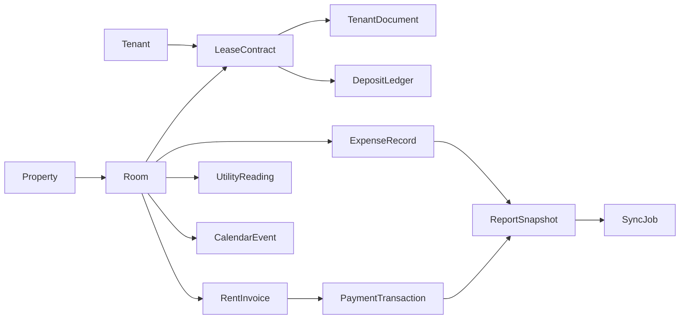

# ER Diagram and Data Contracts

## Entity Summary
- `Property` owns many `Room`
- `Room` has many `LeaseContract`, only one active
- `Tenant` can have many `LeaseContract`
- `LeaseContract` owns `TenantDocument`, `DepositLedger`
- `Room` produces `RentInvoice`, `ExpenseRecord`, `UtilityReading`, `CalendarEvent`
- `RentInvoice` has many `PaymentTransaction`
- `ReportSnapshot` aggregates monthly finance and occupancy data
- `SyncJob` tracks Google Sheets export execution

## Lifecycle States
- Room: `VACANT`, `OCCUPIED`, `MAINTENANCE`
- Lease: `ACTIVE`, `EXPIRED`, `TERMINATED`
- Invoice: `PENDING`, `PARTIAL`, `PAID`, `OVERDUE`
- Sync job: `QUEUED`, `RUNNING`, `SUCCESS`, `FAILED`

## Mermaid ERD

## Data Integrity Rules
- Unique active lease constraint: `roomId` where `status = ACTIVE`
- Unique rent invoice key: `roomId + billingYear + billingMonth`
- Documents require either `tenantId` or `leaseContractId`
- Soft deletion with `deletedAt` on mutable entities
